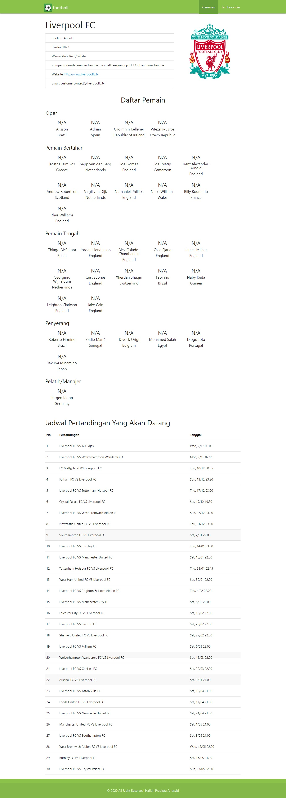

# Submission PWA3
Ini merupakan aplikasi PWA salah satu Course dari Dicoding. Aplikasi merupakan aplikasi yang menampilkan klasemen sepak bola liga inggris, jadwal pertandingan setiap tim dan anda bisa memfavoritkan salah satu tim.

\[Attention\] **tidak boleh dikirimkan untuk submission dicoding, jadikan sebagai referensi.**
Aplikasi ini menggunakan parcel sebagai module bundler. Aplikasi telah di hosting di firebase, anda dapat memeriksanya di [https://submission-pwa3.web.app](https://submission-pwa3.web.app).

## Instalasi
  - Clone atau download dulu terlebih dahulu proyek ini
  - Silahkan jalankan `npm install` untuk mendownload semua dependency
  - Lalu jalankan `npm run dev`
  - Buka http://localhost:1234 di browser 

## Fitur
  - Tampilkan semua tim liga inggris
  - Tampilkan detail tim (jadwal pertandingan, pemain dan pelatih)
  - Favoritkan tim
  - Web Push Notification
  - Responisve Web design

## Screenshoot

